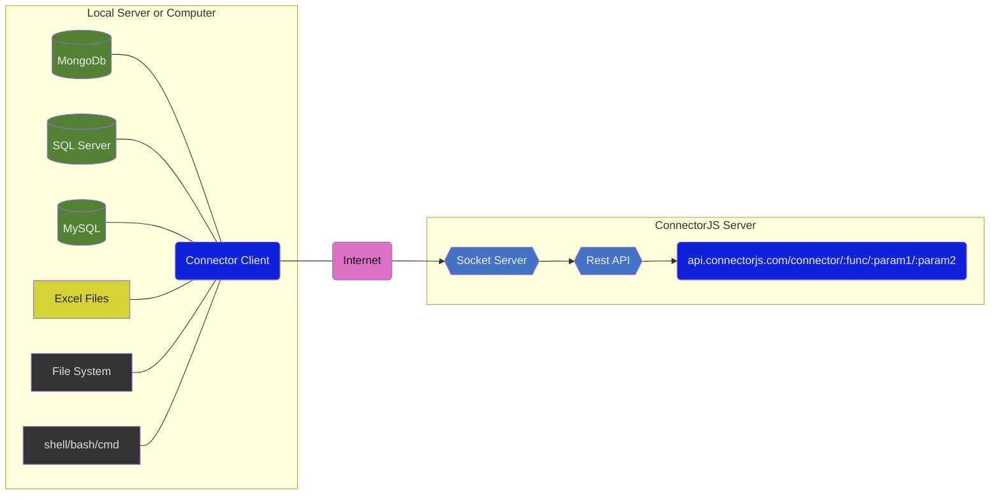

 

# ConnectorJS

Remote connector service. Client Connector provides you processing data from your server or computer via Rest service.

## Table of contents
- [Client Connector](#client-connector)
- [Supported Data Systems](#supported-data-systems)
- [Download & Install](#download--install)
- [clientId & clientPass](#clientid--clientpass)
- [Structure](#structure)
- [ConnectorJS Client API](#connectorjs-client-api)
- [License - MIT License](#license---mit-license)

## Client Connector
Download & install this connector to reach to your pc/server over ConnectorJS Restful Services.

## Supported Data Systems
- SQL Server
- MySQL
- PostgreSQL
- Excel
- File System
- Linux Shell
- Windows Command Prompt

## Download & Install
Download [ClientConnector (for Windows)](https://github.com/connectorjs/connector-server) client connector application.
Unpack zip file and run `connectorjs_setup.exe`

Setup needs administration privileges to install properly.

## clientId & clientPass
When the connector runs first time, it takes new id and password from ConnectorJS Server. You need them for authentication.

## Structure

## ConnectorJS Client API

[ConnectorJS Client API Documentation](https://docs.connectorjs.com/connector/)

## License - MIT License

Copyright (c) 2023-**Now** [MiaJupiter Technology Inc.](https://miajupiter.com). All rights reserved. We are proud to be [Open Source](https://opensource.org). For full details about the license, please check the `LICENSE` file in the root directory of the source repository.
